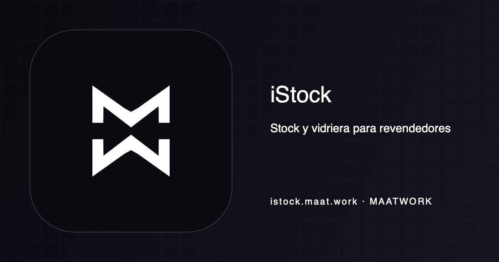

<!-- maatwork-brand:maatwork-mw-20260901 -->
<p align="center"></p>

> Stock y vidriera para revendedores

# iStock

### La vidriera operativa para revendedores de celulares

iStock es el nombre de trabajo de un producto de MaatWork: un SaaS multi-tenant pensado para
resellers del Alto Valle que hoy administran stock en planillas y reciben consultas desde estados de
Instagram o WhatsApp.

**La propuesta, en una línea:** cargás el stock una vez → tenés una vidriera propia → el comprador
llega informado → abre WhatsApp con el equipo y el precio ya escritos.

> **Estado honesto (31 ago 2026):** prototipo funcional/pre-producción. El código de producto,
> sus tests y la configuración de despliegue están en el repositorio, pero no se verificó un deploy
> público ni una corrida CI reciente desde este checkout. No hay screenshots versionadas; por eso no
> se agregan capturas ficticias ni badges verdes sin fuente.

## Qué problema resuelve

Un reseller con 20–200 equipos necesita que el stock que carga en el local sea el mismo que comparte
en redes. Excel no publica fotos ni estados; un estado de Instagram no mantiene precios ni stock; y
un mensaje de WhatsApp que empieza con “hola, info?” obliga a repetir toda la ficha.

iStock concentra ese tramo del recorrido:

1. El dueño carga una unidad o un lote, con fotos, condición, batería, precio en USD y su tipo de
   cambio.
2. La plataforma publica una vidriera por negocio, en `{slug}.maat.work`.
3. El comprador ve la ficha pública y sus opciones de retiro.
4. Un único botón abre WhatsApp con un mensaje contextualizado.

El producto no intenta reemplazar lo que no es su problema: no factura ARCA/AFIP, no es POS, no
usa WhatsApp Business API, no sincroniza MercadoLibre y no cobra la venta online. La operación se
cierra entre comprador y reseller por WhatsApp.

## Qué se puede inspeccionar hoy

| Superficie | Evidencia en el árbol | Estado observable |
| --- | --- | --- |
| Marketing y planes | `apps/web/app/(marketing)/` | Landing, recorrido de 14 días y página de precios en español rioplatense. |
| Panel | `apps/web/app/(app)/app/(panel)/` | Alta de negocio, autenticación local de desarrollo, stock, fotos, import CSV, publicación, reservas, ventas manuales, canjes y ajustes. |
| Vidriera | `apps/web/app/(storefront)/` | Catálogo por host, ficha pública, estados de stock, USD + ARS, puntos de retiro, canje y CTA `wa.me`. |
| Routing multi-tenant | `apps/web/proxy.ts` + `apps/web/app/(storefront)/_lib/host.ts` | Traduce el host del negocio a una ruta interna sin consultar Postgres ni confiar en un header enviado por el cliente. |
| Reglas de negocio | `packages/domain/src/` | TS puro: estados de una unidad, reservas, FX, slugs, DTO público y payload de WhatsApp. |
| Persistencia y aislamiento | `packages/db/src/schema/` + `packages/db/drizzle/` | Drizzle, migraciones versionadas, Postgres y RLS por tenant. |
| Fotos | `packages/media/src/` | Pipeline con `sharp`; driver local para desarrollo y adapter R2 para producción, con variantes públicas y master privado. |
| Chatbot | `packages/ai/src/` | Paquete server-only con prompts, tools, handoff, límites de contexto y evals. La ruta web `/api/chat` todavía no está presente en este checkout. |
| Suscripciones | `apps/web/app/(billing)/` | Código de planes, entitlements, Mercado Pago Subscriptions y webhook idempotente; la conexión productiva requiere credenciales externas. |
| Expiración de reservas | `vercel.json` + `apps/web/app/api/cron/expire-reservations/` | Declaración de Vercel Cron cada 5 minutos y handler protegido por `CRON_SECRET`. La publicación efectiva en Vercel no fue verificada. |

## Arquitectura

```text
Comprador
   │  {slug}.maat.work
   ▼
Next.js Proxy ── host → /s/{slug} (sin DB, sin estado, sin tenant header confiable)
   │
   ├── Vidriera pública ── Cache Components / ISR ── PublicListingDTO ──► CDN/R2
   │                                      └──────► wa.me
   │
   └── Panel autenticado ── Server Actions / Route Handlers ──► Drizzle/Postgres
                                                            └─► RLS + tenant_id

Upload de foto ──► sharp ──► thumb / card / detail + master privado ──► local o Cloudflare R2
```

Decisiones que vale la pena revisar en una entrevista técnica:

- **Un solo modelo de datos multi-tenant.** Las tablas de negocio llevan `tenant_id`; Postgres
  aplica RLS y las queries de aplicación agregan el filtro de tenant como defensa en profundidad.
- **La vidriera no resuelve el tenant desde un header.** `proxy.ts` sólo valida la forma del host y
  reescribe; la existencia del negocio la decide la ruta cacheada. Eso permite que el cache key sea
  estable y evita una query por pageview.
- **El DTO público es un límite de confianza.** El comprador recibe sólo la ficha publicable; IMEI,
  costo, margen, proveedor y notas internas no forman parte del modelo público.
- **Fotos optimizadas antes de salir.** El upload produce variantes WebP y mantiene el original en
  un bucket privado cuando se usa R2. La vidriera no sirve el master.
- **La lógica de dominio es aislada.** `packages/domain` no importa Next, Drizzle, Supabase ni
  `process.env`; sus invariantes se pueden probar sin levantar la aplicación.

El diseño fija como objetivo que el 95% de los hits de la vidriera no toque Postgres. Ese objetivo
está cubierto por decisiones de cache y tests locales; el comportamiento del CDN de una cuenta
Vercel desplegada todavía no está verificado.

## Stack

| Capa | Tecnología |
| --- | --- |
| Web | Next.js 16 App Router, React 19, TypeScript `strict`, Tailwind CSS |
| Datos | Neon Postgres + Neon Auth (integrados en Vercel), RLS, Drizzle ORM y migraciones SQL versionadas |
| Media | `sharp`, Cloudflare R2 + CDN; filesystem local para desarrollo |
| IA | Vercel AI SDK en el diseño, providers configurados por environment y fallback; implementación aislada en `packages/ai` |
| Billing | Mercado Pago Subscriptions, con driver mock local |
| Jobs | Vercel Cron; no hay worker 24/7 |
| Calidad | Vitest, Playwright, typecheck de TypeScript y gates estáticos propios |
| Tooling | Node.js ≥22, pnpm 10.34.5 |

Las versiones exactas y variables disponibles están en los `package.json` de cada workspace y en
[`.env.example`](.env.example). Los secretos no se guardan en el repositorio.

## Correrlo en local

Requisitos: Node.js 22 o superior, pnpm 10.34.5 y un PostgreSQL local con `psql` disponible. El
script local crea una base `istock_dev` y emula sólo lo necesario para probar roles y RLS compatibles
con Neon; no emula Neon Auth, Storage, Realtime ni pgvector.

```bash
git clone https://github.com/Gigisanta/iStock-software.git
cd iStock-software

corepack enable
corepack prepare pnpm@10.34.5 --activate
pnpm install --frozen-lockfile

cp .env.example .env.local
./scripts/pg-local.sh
pnpm db:migrate
pnpm db:seed
pnpm --filter @istock/web dev
```

Abrí:

- `http://localhost:3000` — marketing.
- `http://localhost:3000/precios` — planes.
- `http://localhost:3000/demo` — alias local que redirige a la vidriera seed `demo`.
- `http://demo.localhost:3000/` — vidriera del tenant demo, si el navegador resuelve subdominios de
  `localhost`.
- `http://localhost:3000/ingresar` — en modo local se puede entrar con un email válido sin enviar
  un correo; esa autenticación es deliberadamente sólo de desarrollo.

El seed es determinista y contiene datos sintéticos. Sin `SEED_DEMO_WA_PHONE`, el contacto de
WhatsApp del demo es un placeholder; no se debe presentar ese seed como una cuenta productiva ni
ejecutarlo contra datos reales.

Para probar el servidor en el modo que usa Playwright —build de producción más `next start`— se
usa `pnpm e2e`. Esa corrida necesita PostgreSQL, Chromium y un entorno local limpio; el harness
configura su propio driver de auth, media y billing.

## Validación

La CI declarada en [`.github/workflows/ci.yml`](.github/workflows/ci.yml) instala dependencias,
ejecuta typecheck, lint, migraciones, seed, tests, gates de seguridad y Playwright. Los comandos
útiles son:

```bash
pnpm typecheck
pnpm lint
pnpm test
pnpm e2e
pnpm audit
```

### Corrida local de este checkout

Los números siguientes son una fotografía de la corrida local del 31 ago 2026, no una insignia de
CI:

| Comando | Resultado |
| --- | --- |
| `pnpm --filter @istock/domain test` | **244 passed** en 13 archivos. |
| `pnpm --filter @istock/media test` | **164 passed** en 11 archivos. Incluye pipeline de imágenes y contratos de R2. |
| `pnpm --filter @istock/ai test` | **591 passed** en 20 archivos. |
| `pnpm --filter @istock/web test` | **985 passed, 4 skipped** en 61 archivos. |
| `pnpm --filter @istock/db test` | **478 passed** en 18 archivos. |
| `pnpm --filter @istock/tests test` | **448 passed** en 9 archivos. |

Estas cifras son una fotografía local; la producción todavía requiere aplicar la migración remota,
configurar los secretos de proveedores y verificar un deploy público.

## Estado y límites conocidos

- **Pre-producción:** Neon y Neon Auth ya están conectados al proyecto Vercel; falta aplicar la migración
  remota y registrar `https://istock.maat.work` como origen confiable de Neon Auth.
- **Infraestructura externa:** el dominio Vercel y el CDN R2 ya están configurados; faltan las credenciales
  de acceso R2, Mercado Pago y Gemini/Groq, que nunca se guardan en el repositorio.
- **Chatbot:** `packages/ai` tiene lógica y evals, pero falta cablear la superficie web `/api/chat`,
  su observabilidad y su rate limit en el borde.
- **Browser y CDN:** los specs de Playwright y los gates existen; no se afirma aquí que hayan sido
  ejecutados contra un deploy de Vercel. El alias `/demo` tiene tests unitarios, pero su redirección
  sobre una red pública requiere la aceptación pendiente.
- **Calidad en movimiento:** la corrida indicada arriba conserva dos fallos de integración causados
  por cambios del workspace ajenos a este README. Deben resolverse antes de usar el repositorio como
  señal de release.

## Roadmap verificable

1. **Cerrar infraestructura de producción:** migración Neon + RLS, credenciales R2, sandbox de Mercado
   Pago, credenciales de providers y reglas WAF de Vercel.
2. **Cerrar la superficie web del chatbot:** `/api/chat`, handoff a WhatsApp, consumo de métricas de
   presupuesto y rate limiting WAF.
3. **Reejecutar la aceptación completa:** typecheck/lint/gates, migración + seed limpios, Playwright
   contra `next build`/`next start` y verificación del deploy real.
4. **Resolver deuda de producto ya documentada:** idempotencia del import CSV, cobertura e2e del
   canje y de `/demo`, y la aceptación pendiente del guard de keys de IMEI.

El detalle de decisiones, cobertura y blockers está en [`docs/ARCHITECTURE.md`](docs/ARCHITECTURE.md),
[`docs/TEST_MATRIX.md`](docs/TEST_MATRIX.md) y [`docs/SLICE_BOARD.md`](docs/SLICE_BOARD.md). Esos
documentos son la fuente de verdad para saber qué está decidido, qué está medido y qué sigue abierto.

## Licencia y alcance

El checkout no contiene un archivo `LICENSE`; los términos de reutilización no están definidos en
el repositorio. iStock es nombre de código interno; cualquier uso comercial, datos reales o
despliegue debe pasar por la configuración de producción y sus controles de seguridad.
